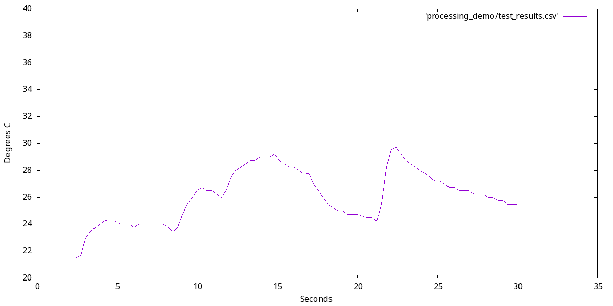

## Arduino Wagon Wheel Testing Scripts

The ser.py program reads from an arduino over serial to get temperature, then puts the data in test_data.csv

This data can then be read in by gnuplot using ./plot.sh to make a graph

smooth-plot.sh Is the same as plot.sh, except that it applys a smoothing filter to get rid of the jagged edges.

smooth.py reads the data that ser.py outputs, and smooths out the outliers. Below is a before and after comparison.

Example Graphs:
Before:

After:

I still need to add support for multiple "streams" over serial, I just need to figure out the best way to do that.